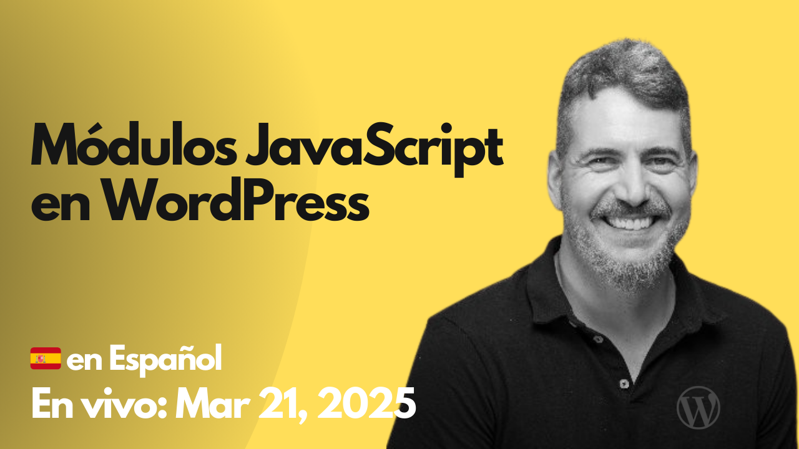

# 2025-03-28 Módulos Javascript en WordPress

🎥 **Watch this session on YouTube:** [Módulos Javascript en WordPress](https://www.youtube.com/watch?v=JWQzGGA_Faw)

En esta sesión vemos cosas como:

- cómo funciona este sistema de módulos
- cómo generar en WordPress una "build" que compile todas los imports en un único archivo.
- cómo preparar en WordPress nuestros módulos para que puedan ser cargados dinámicamente en el front-end.

Los recursos utlizados en la sesión son:

- https://github.com/WordPress/block-development-examples
- [Script Modules in 6.5](https://make.wordpress.org/core/2024/03/04/script-modules-in-6-5/) | DevNote WP6.5
- [Block metadata viewScriptModule field in 6.5](https://make.wordpress.org/core/2024/03/04/block-metadata-viewscriptmodule-field-in-6-5/) | DevNote WP6.5
- [JavaScript Modules](https://developer.mozilla.org/en-US/docs/Web/JavaScript/Guide/Modules) | MDN
- [Updates to Script Modules in 6.7](https://make.wordpress.org/core/2024/10/14/updates-to-script-modules-in-6-7/) | DevNote WP6.7
- https://excalidraw.com/#json=_TWLHcoLQbw1oWIHA_wRf,AYOe_MZq2jOumKAzB-aMHQ
- [Working with JavaScript for the Block Editor](https://developer.wordpress.org/block-editor/getting-started/fundamentals/javascript-in-the-block-editor/) | Block Editor Handbook
- [React Without JSX](https://legacy.reactjs.org/docs/react-without-jsx.html) | Legacy React Docs
- [Scripts registered in WordPress (handles)](https://developer.wordpress.org/block-editor/contributors/code/scripts/) | Block Editor Handbook
- [`@wordpress/dependency-extraction-webpack-plugin`](https://developer.wordpress.org/block-editor/reference-guides/packages/packages-dependency-extraction-webpack-plugin/#behavior-with-script-modules)

El código de los proyectos vistos en la sesión estan en:

- JS Modules for build
  - https://github.com/juanma-wp/streams/tree/main/projects/2025/wp-data-layer-app-pages
  - https://github.com/juanma-wp/streams/tree/main/projects/2025/simple-block-build-process
- Script Modules API
  - https://github.com/juanma-wp/script-modules-custom-webpack/tree/main
