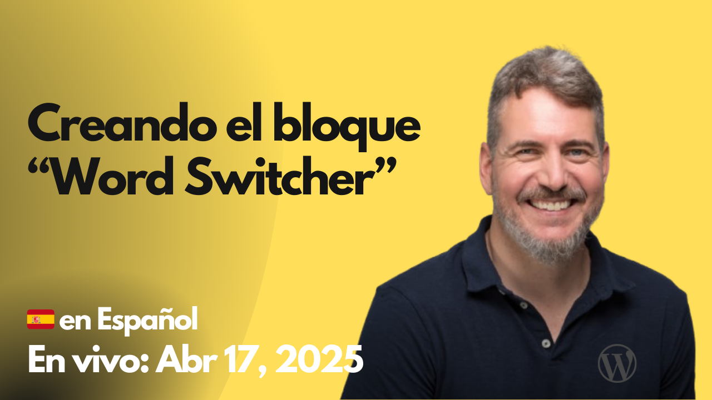

# 2025-04-17 Creando el bloque "Word Switcher"

🎥 **Watch this session on YouTube:** [Creando el bloque "Word Switcher"](https://www.youtube.com/watch?v=HC-vUcIqbH8)

- https://excalidraw.com/#json=qeSO5b5krcUKwzhHLPTdZ,E3WQfWWjioPvVfUKiul3uw
- https://developer.wordpress.org/block-editor/reference-guides/interactivity-api/
- https://developer.wordpress.org/block-editor/how-to-guides/format-api/
- https://developer.wordpress.org/block-editor/reference-guides/packages/packages-block-editor/#richtexttoolbarbutton
- https://developer.wordpress.org/reference/classes/wp_html_tag_processor/
- https://developer.wordpress.org/block-editor/getting-started/fundamentals/registration-of-a-block/
- https://developer.wordpress.org/block-editor/getting-started/fundamentals/markup-representation-block/
- https://developer.wordpress.org/block-editor/getting-started/fundamentals/static-dynamic-rendering/
- https://developer.wordpress.org/block-editor/reference-guides/richtext/
- https://github.com/WordPress/gutenberg/blob/HEAD/packages/block-editor/src/components/rich-text/README.md
- https://europe.wordcamp.org/2025/
- https://europe.wordcamp.org/2025/session/the-block-developer-cookbook-wceu-2025-edition/
- https://blockdevelopercookbook.com/
-

El código del proyecto trabajado en la sesión está disponible en:
https://github.com/juanma-wp/streams/tree/main/projects/word-switcher
