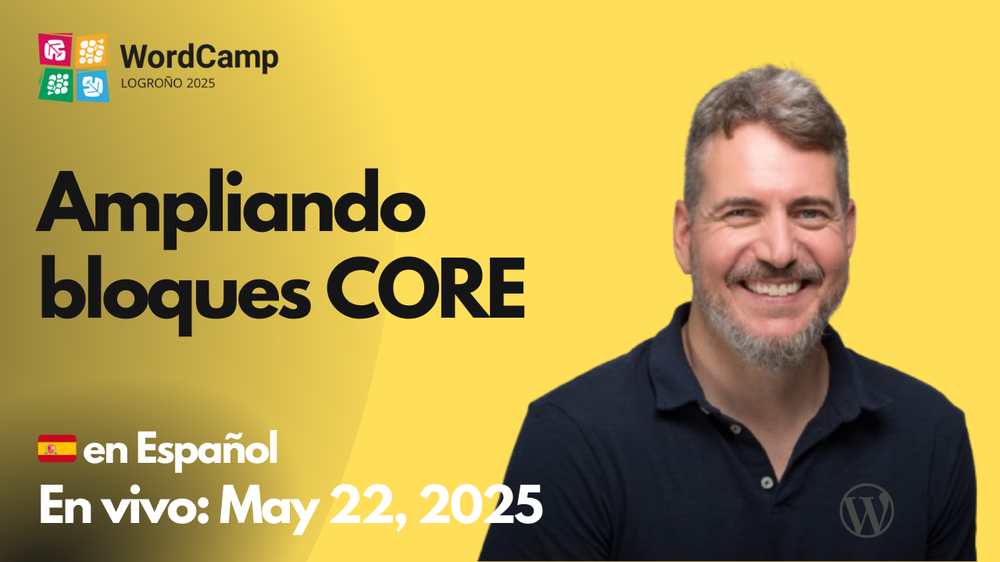

# 2025-05-22 Expandiendo bloques CORE

🎥 **Watch this session on YouTube:** [Expandiendo bloques CORE](https://www.youtube.com/watch?v=j6IUDEnApfE)

- https://logrono.wordcamp.org/2025/session/realmente-necesitas-desarrollar-un-bloque-nuevo-veamos-algunas-alternativas/
- https://excalidraw.com/#json=glwdtUmVgi99WcLuQrh7F,1fxAnTskKOa5iiVaLSDepA
- https://github.com/ryanwelcher/advanced-query-loop
- https://learn.wordpress.org/course/using-the-wordpress-data-layer/
- https://developer.wordpress.org/news/2023/02/intrinsic-design-theming-and-rethinking-how-to-design-with-wordpress/
- https://github.com/juanma-wp/wc-logrono-2025-talk/tree/main
- https://developer.wordpress.org/block-editor/reference-guides/filters/block-filters/#editor-blockedit
- https://wordpress.org/plugins/browse/block/
- https://github.com/WordPress/gutenberg/blob/80a371ebe73755ab4b78ae8f9624b007c9c0e50d/packages/block-library/src/quote/block.json

El proyecto trabajado en esta sesión está disponible en:
https://github.com/juanma-wp/streams/tree/main/projects/2025/core-blocks-expansion
