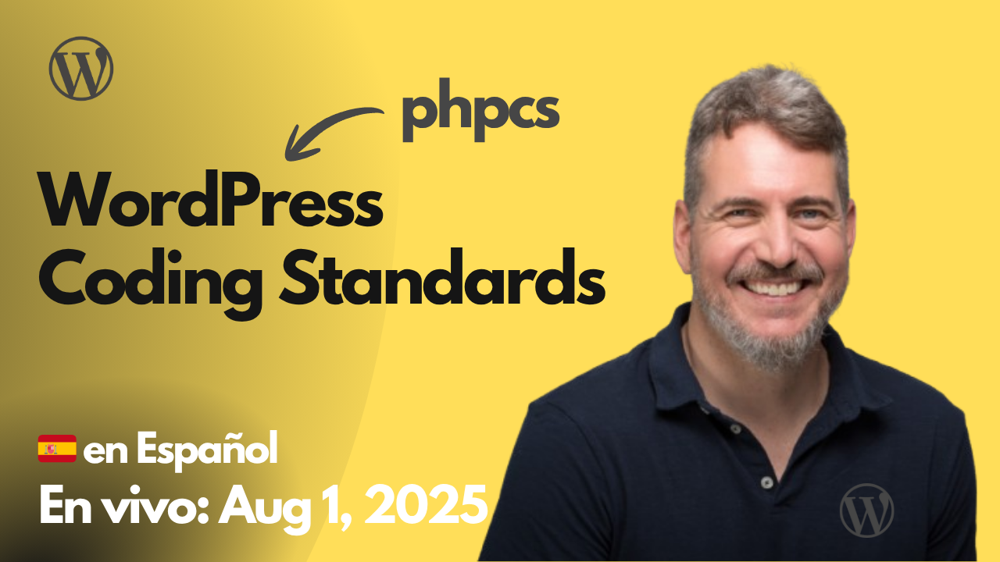

# 2025-08-01 WordPress Coding Standards

The project worked in this session is available at:
https://github.com/juanma-wp/streams/tree/main/projects/wpcs-experiments

- https://excalidraw.com/#json=Z1L-wm-TMW3XWXEU9OFd8,4kYSjpYN2XmgagfqLHeZew
- https://github.com/WordPress/WordPress-Coding-Standards
- https://github.com/WordPress/WordPress-Coding-Standards/releases/tag/3.2.0
- https://github.com/PHPCSStandards/composer-installer
- https://github.com/PHPCSStandards/PHP_CodeSniffer
  - https://github.com/squizlabs/PHP_CodeSniffer
  - https://github.com/squizlabs/PHP_CodeSniffer/issues/3932