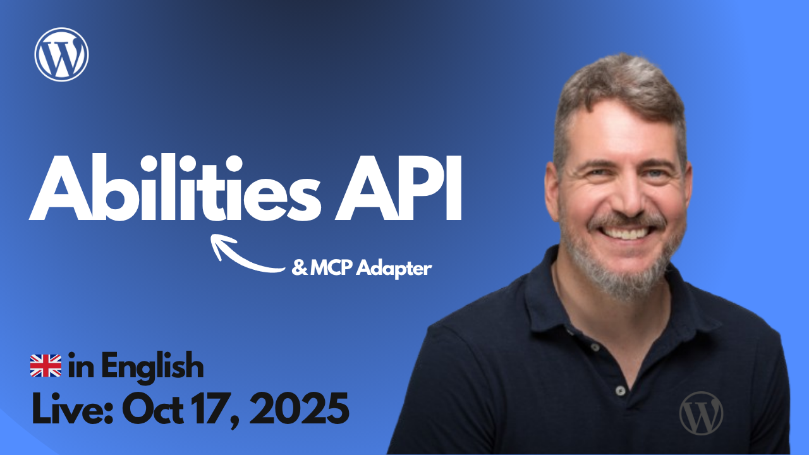

# 2025-10-17 Abilities API

[](https://www.youtube.com/live/m19VM2yIbHU?si=SPlZiVTm1qab-pg9)


🎥 **Watch this session on YouTube:** [Abilities API](https://www.youtube.com/live/m19VM2yIbHU?si=SPlZiVTm1qab-pg9)

The project worked in this session is available at:
https://github.com/juanma-wp/streams/tree/main/projects/test-stream-abilities-api


```json
   "wordpress": {
      "command": "npx",
      "args": ["-y", "@automattic/mcp-wordpress-remote"],
      "env": {
        "WP_API_URL": "https://streams.wp.local/wp-json/my-namespace/mcp",
        "WP_API_USERNAME": "admin",
        "WP_API_PASSWORD": "MUgh XXXX DmVb XXXX L8v4 XXXX",
        "LOG_FILE": "/Users/juanmanuelgarrido/STUDIO/streams/wp-content/mcp-debug.log"
      }
    },
```

- https://github.com/Automattic/mcp-wordpress-remote
  - https://github.com/Automattic/mcp-wordpress-remote/tree/trunk/Docs
- https://gist.github.com/juanmaguitar/29c5a7b70d605a5a3b9ade1c23fe398a
- https://github.com/WordPress/abilities-api/tree/d9c061ff2d1f5c753eb77359663017fce725285d
- https://github.com/WordPress/gutenberg/issues/70710
- https://excalidraw.com/#json=5eJhxD4u-mCmFhupzafnI,7LBF-4AM6XOqKlAmTh0-Ng
- https://freelandev.com/podcast/321-el-futuro-de-la-ia-en-wordpress-con-juanma-garrido/
- https://make.wordpress.org/ai/2025/07/17/ai-building-blocks/
- https://make.wordpress.org/ai/2025/07/17/abilities-api/
  - https://github.com/WordPress/abilities-api/tree/trunk/docs
- https://make.wordpress.org/ai/handbook/
- https://github.com/WordPress/abilities-api/pull/117
- https://github.com/WordPress/abilities-api/issues/111
- https://github.com/WordPress/mcp-adapter
- 