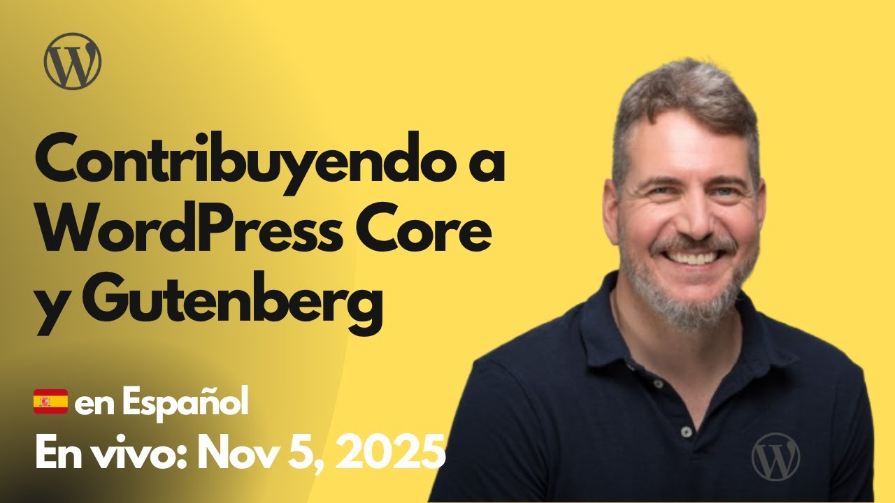

# 2025-11-05 Contribuyendo a WordPress Core y Gutenberg

🎥 **Watch this session on YouTube:** [Contribuyendo a WordPress Core y Gutenberg](https://youtube.com/live/P-xd7AWSQpo)

Aquí tienes **la lista de los recursos compartidos**, durante la sesión o relacionados:

**DeepWiki**

* [https://deepwiki.com/juanma-wp/wordpr](https://deepwiki.com/juanma-wp/wordpr)...

**GitHub – Repositorios**

* [https://github.com/Automattic/experim](https://github.com/Automattic/experim)...
* [https://github.com/juanma-wp](https://github.com/juanma-wp)

**Blog Posts**

* [Cómo contribuir a Gutenberg: scripts NPM y configuración local](https://juanma.codes/2025/11/06/como-contribuir-a-gutenberg-scripts-npm-y-configuracion-local/)

**Slides**

* [Contributing to WordPress - WordCamp Valencia 2025](https://docs.google.com/presentation/d/1_9eKO8idwn_M_iNtDEhbfrzWHboDZn4LLJUUmOlVK_U/edit?usp=sharing)