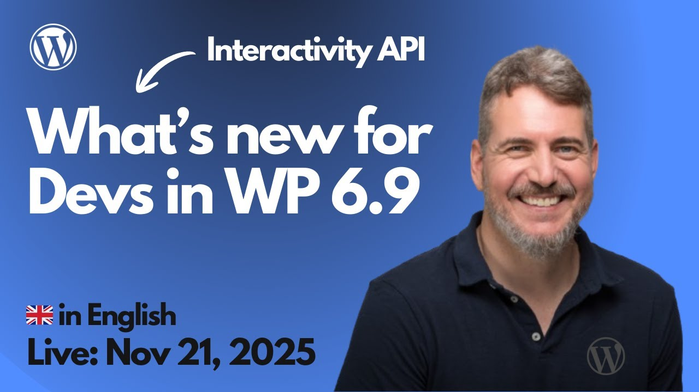

# 2025-11-21 What's new for Devs in Wp 6.9: Interactivity API

🎥 **Watch this session on YouTube:** [What's new for Devs in Wp 6.9: Interactivity API](https://youtube.com/live/8X8ztWQFx9E)

Here you have **a list of shared resources**, during the session:

**Developer Documentation – WordPress.org**

* [https://developer.wordpress.org/block-editor/reference-guides/interactivity-api/](https://developer.wordpress.org/block-editor/reference-guides/interactivity-api/)

**GitHub – Block Development Examples**

* [https://github.com/WordPress/block-development-examples/tree/trunk](https://github.com/WordPress/block-development-examples/tree/trunk)

**Block Development Examples – Live Demos**

* [https://wordpress.github.io/block-development-examples/?tags=interactivity-api](https://wordpress.github.io/block-development-examples/?tags=interactivity-api)

**WordPress.tv**

* [https://wordpress.tv/2025/11/18/developer-hours-wordpress-6-9-dataviews-dataform-abilities-api/](https://wordpress.tv/2025/11/18/developer-hours-wordpress-6-9-dataviews-dataform-abilities-api/)
* [https://wordpress.tv/2025/12/02/developer-hours-wordpress-6-9-block-bindings-interactivity-api/](https://wordpress.tv/2025/12/02/developer-hours-wordpress-6-9-block-bindings-interactivity-api/)

**Meetup – Learn WordPress Online Workshops**

* [https://www.meetup.com/es-es/learn-wordpress-online-workshops/events/312110895/](https://www.meetup.com/es-es/learn-wordpress-online-workshops/events/312110895/)

