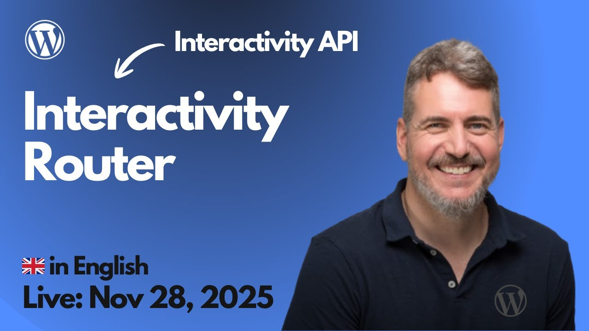

# 2025-11-28 Interactivity Router

🎥 **Watch this session on YouTube:** [Interactivity Router](https://youtube.com/live/hlbT0fnIe8E)

Here you have **a list of shared resources**, during the session:

Aquí tienes **la lista de todos los recursos compartidos**, organizada en el formato que buscas:

**Developer Documentation – Interactivity API**

* [https://developer.wordpress.org/block-editor/reference-guides/interactivity-api/](https://developer.wordpress.org/block-editor/reference-guides/interactivity-api/)
* [https://developer.wordpress.org/block-editor/reference-guides/interactivity-api/core-concepts/undestanding-global-state-local-context-and-derived-state/](https://developer.wordpress.org/block-editor/reference-guides/interactivity-api/core-concepts/undestanding-global-state-local-context-and-derived-state/)

**Block Development Examples – GitHub & Demos**

* [https://wordpress.github.io/block-development-examples/](https://wordpress.github.io/block-development-examples/)
* [https://wordpress.github.io/block-development-examples/?tags=interactivity-api](https://wordpress.github.io/block-development-examples/?tags=interactivity-api)
* [https://github.com/juanma-wp](https://github.com/juanma-wp)
* [https://github.com/juanma-wp/interactivity-router-region-quiz](https://github.com/juanma-wp/interactivity-router-region-quiz)
