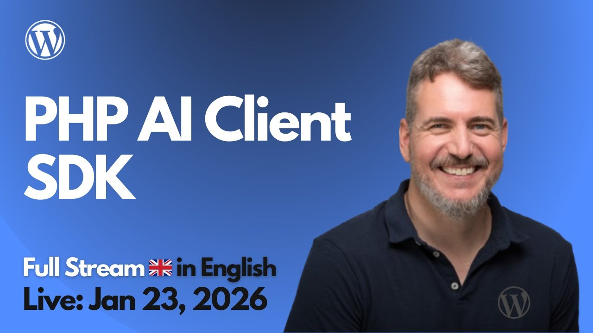

# 2026-01-23 PHP AI Client SDK

🎥 Watch this session on YouTube: [PHP AI Client SDK](https://youtube.com/live/lNAh5B0xh6I)

The project worked in the session is available at:
https://github.com/juanma-wp/streams/tree/main/projects/2026/php-ai-client-demo-stream

---

A summary of this stream session can de found at:
https://www.youtube.com/watch?v=PjCgcnrd8P0

In this live stream, we explore the **PHP AI Client SDK** and how it fits into the emerging AI stack around WordPress. We map it alongside the **Abilities API**, the **MCP adapter**, and the **AI Experiments** plugin, then dig into what “provider-agnostic” AI integration really means for plugin developers: one interface, multiple model providers, and fewer repeated SDK/credential implementations across the ecosystem.

In the second half, we go hands-on. We scaffold a **minimal WordPress plugin** that pulls the SDK in via Composer, try to run simple text generation from a local WP environment (including via WP-CLI), and then troubleshoot the classic “provider not configured / no models found” situation by tracing how provider discovery and credentials are expected to work.

It’s practical, a bit messy (in a good way), and ends with a clear next step: a follow-up session to complete a successful end-to-end call once the initialization/config pieces are fully nailed down.