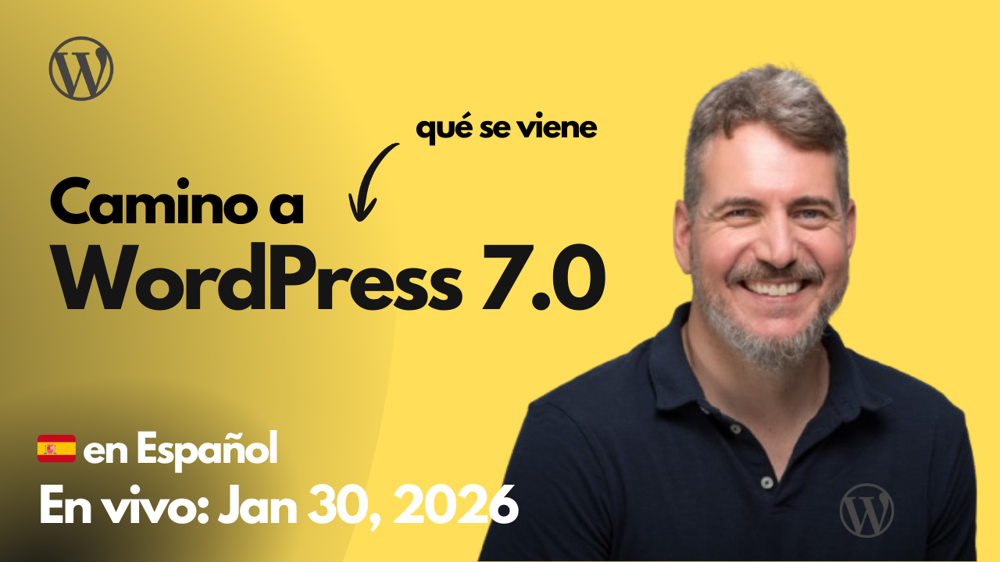

# 2026-01-30 Camino a WordPress 7.0

🎥 Mira esta sesión en YouTube: [Camino a WordPress 7.0](https://www.youtube.com/live/ouO5T6xA-4E)

Recursos utilizados en la sesión:

- https://make.wordpress.org/core/2025/12/11/planning-for-7-0/
- https://make.wordpress.org/core/7-0/
- https://excalidraw.com/#json=wODKiaD2PfR9bO99BCita,xEaS8C2kb1jbCnvJsKAFaA
- https://playground.wordpress.net/
- https://developer.wordpress.org/
- https://wordpress.org/themes/
- https://make.wordpress.org/core/2026/01/27/bug-scrub-schedule-for-wordpress-7-0/
- https://developer.wordpress.org/block-editor/contributors/versions-in-wordpress/
- https://wordpress.org/about/roadmap/
- https://make.wordpress.org/core/tag/phase-3/
- https://make.wordpress.org/core/2023/03/24/phase-3-collaboration/
- https://github.com/WordPress/gutenberg/issues/74786#issuecomment-3819616779
- https://github.com/WordPress/gutenberg
- https://make.wordpress.org/
- https://make.wordpress.org/chat/
- https://github.com/orgs/WordPress/projects/271/views/1
- [Collaborative Editing iteration for WordPress 7.0](https://github.com/WordPress/gutenberg/issues/74549)
