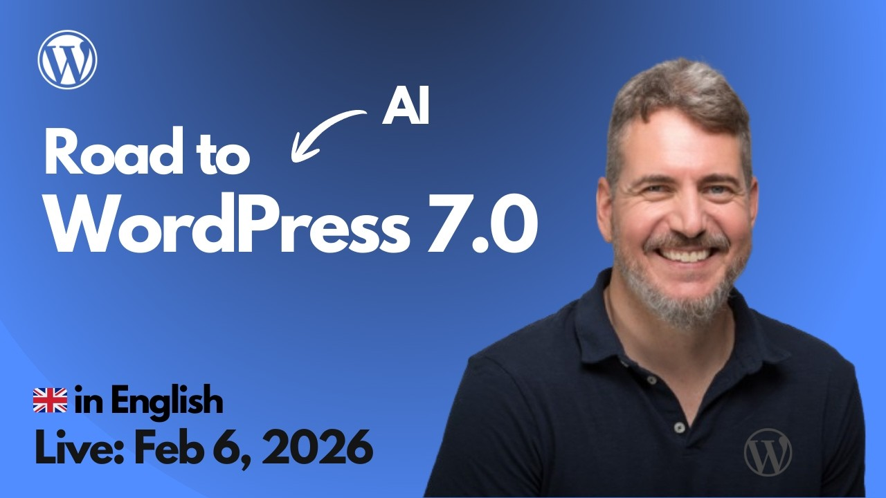

# 2026-02-06 Road to WordPress 7.0: Upcoming AI features

🎥 Mira esta sesión en YouTube: [Road to WordPress 7.0: Upcoming AI features](https://www.youtube.com/watch?v=0o73vD9AYz0)

---

Resources used during the session:

WordPress Core Abilities PR
 - https://github.com/WordPress/wordpress-develop/pull/10665
 - https://github.com/WordPress/wordpress-develop/pull/10665/changes
 
WordPress Core Abilities Issue
 - https://github.com/WordPress/ai/issues/40
 - https://github.com/WordPress/gutenberg/issues/70710
 
AI Component for WordPress 7.0:
- https://core.trac.wordpress.org/query?status=accepted&status=assigned&status=new&status=reopened&status=reviewing&component=AI&milestone=7.0

[Proposal for merging WP AI Client into WordPress 7.0](https://make.wordpress.org/core/2026/02/03/proposal-for-merging-wp-ai-client-into-wordpress-7-0/)
- https://core.trac.wordpress.org/ticket/64591

All 7.0 Tickets: https://core.trac.wordpress.org/query?status=accepted&status=assigned&status=new&status=reopened&status=reviewing&milestone=7.0

Ticket #64587 (AI Guidelines): https://core.trac.wordpress.org/ticket/64587