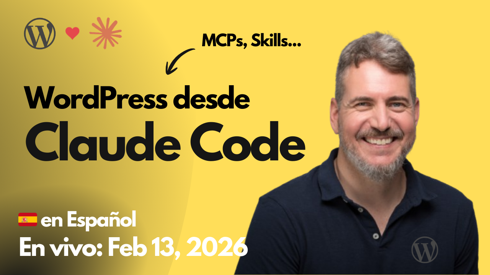

# 2026-02-13 WordPress desde Claude Code

🎥 Mira esta sesión en YouTube: [WordPress desde Claude Code](https://www.youtube.com/watch?v=WeAi50Ci0PQ)

El proyecto trabajado en esta sesión está disponible en:
https://github.com/juanma-wp/streams/tree/main/projects/2026/wp-loves-claude-code

---

Recursos utilizados en la sesión:

- https://github.com/WordPress/mcp-adapter
- https://github.com/jonathanbossenger/wp-abilities-api-demo
- https://code.claude.com/docs/en/mcp
- https://juanma.codes/2025/09/19/playing-with-telex-building-a-mermaid-diagram-block-in-just-a-few-prompts/
- https://excalidraw.com/#json=k78ST0NrmKlU5OU9Jc8Qt,kvAIpFy_tKugpLq-w3mS_A
- https://github.com/WordPress/agent-skills/
- https://help.figma.com/hc/en-us/articles/32132100833559-Guide-to-the-Figma-MCP-server
- https://www.aura.build/editor/c1e2b877-d2bf-4014-8a50-1db65fe75c6c
- https://github.com/StitchAI/stitch-ai-mcp
- https://stitch.withgoogle.com/
- https://telex.automattic.ai/projects/de5e35ab
- https://opencode.ai/
- https://claude.com/connectors/wordpress-com
- 