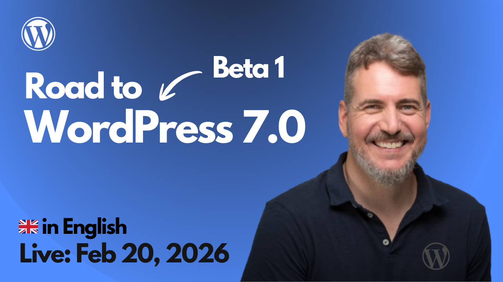

# 2026-02-20 Road to WordPress: Beta 1

🎥 Mira esta sesión en YouTube: [Road to WordPress: Beta 1](https://www.youtube.com/watch?v=h_foYO9QO1s)

---

Recursos utilizados en la sesión:

- https://excalidraw.com/#json=wwKLENKzXYDFKh3n429V9,LYQEL3oIXT5hyPeXC0xj1Q
- [WordPress 7.0 RoadMap](https://make.wordpress.org/core/7-0/)
- [WordPress 7.0 Beta 1](https://wordpress.org/news/2026/02/wordpress-7-0-beta-1/)
- [Commits on `wordpress-develop` on Feb 20th](https://github.com/WordPress/wordpress-develop/commits/trunk/?since=2026-02-20&until=2026-02-20)
- [Proposal for merging WP AI Client into WordPress 7.0](https://make.wordpress.org/core/2026/02/03/proposal-for-merging-wp-ai-client-into-wordpress-7-0/)
- [Update on Proposal for merging WP AI Client into WordPress 7.0](https://make.wordpress.org/core/2026/02/03/proposal-for-merging-wp-ai-client-into-wordpress-7-0/#comment-48408)
- [Matt's comment on Proposal for merging WP AI Client into WordPress 7.0](https://make.wordpress.org/core/2026/02/03/proposal-for-merging-wp-ai-client-into-wordpress-7-0/#comment-48384)
- [Add WP AI Client and corresponding connectors screen - TRAC ticket](https://core.trac.wordpress.org/ticket/64591)
- [Summary of WordPress 7.0 Product Review Meeting with @matt](https://make.wordpress.org/core/2026/02/18/wordpress-7-0-product-review-meeting-with-matt/#comment-48403)
- [Help Test WordPress 7.0](https://make.wordpress.org/test/2026/02/20/help-test-wordpress-7-0/)
- [The CHANGES LEVELLING UP Navigation in WordPress 7.0 - the roadmap REVEALED](https://www.youtube.com/watch?v=wWR6_DHQoI4)
- [What’s new in Gutenberg... posts](https://make.wordpress.org/core/tag/gutenberg-new/) 
- [Core Contributor Handbook](https://make.wordpress.org/core/handbook/)

Others 
- https://make.wordpress.org/ai/2026/02/04/call-for-testing-exploring-new-ai-experiments/
- State of tasks for Beta 1: https://make.wordpress.org/core/2025/12/11/planning-for-7-0/#comment-48392
- https://github.com/orgs/WordPress/projects/271